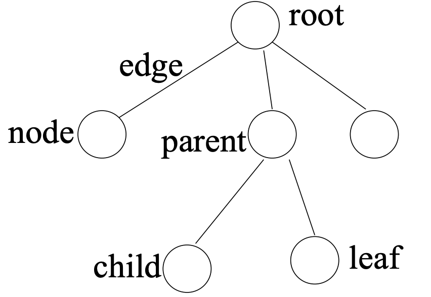
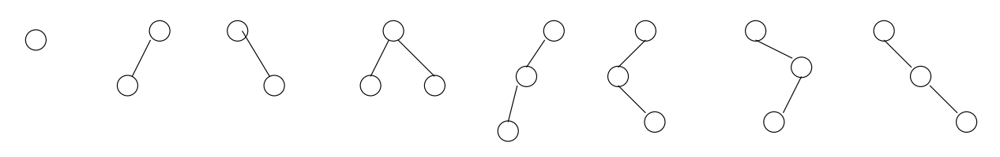
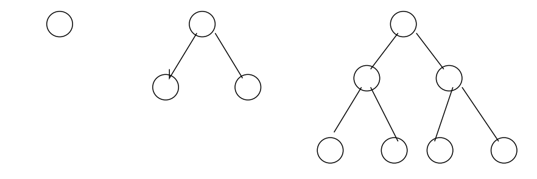
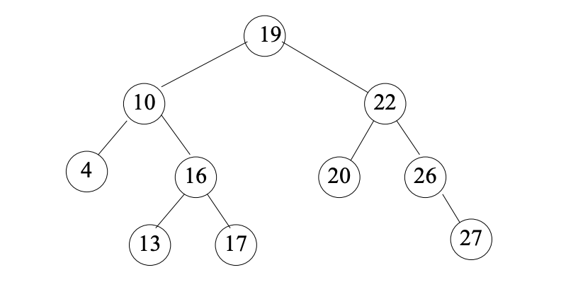
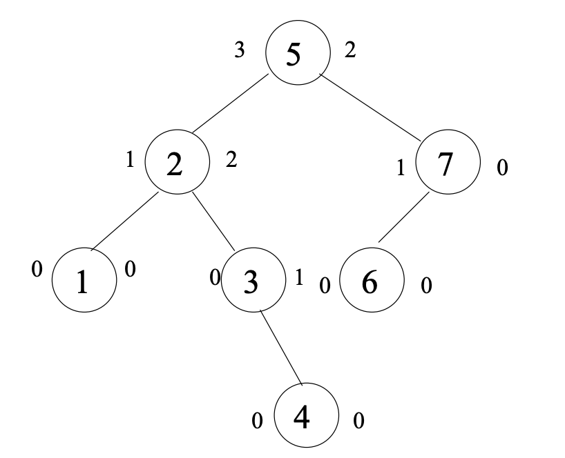
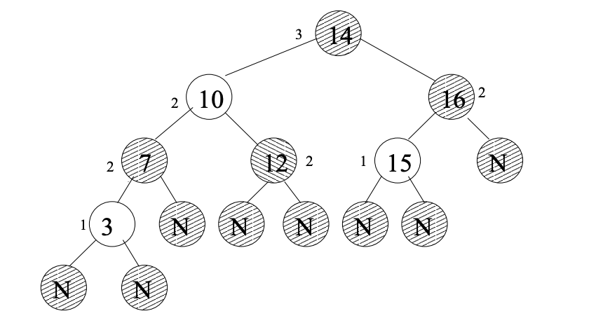

# Trees

In contrast to Arrays or Linked lists, that are linear structures where the time required to search is proportional to the size of the data. Trees represent a better alternative to store and search data. 

A Tree is defined as a collection of *nodes* connected by *directed or undirected edges*. By concept is non linear and has some particularities:

- It has one node that acts as a **root**.
- Every node (excluding the root) is conneted by a directed **edge** from one other node. In the form (parent -> children).
- Each node can have an arbitrary number of children. 
- Nodes with no children are called **leaves** or external nodes.
- Nodes that are not leaves are called **internal nodes** and have at least one child
- Nodes with same parent are called **siblings**.
- The **depth** of a node is the *number of edges* from the root to the node.
- The **height of a node** is the *number of edges* from the node to the deepest leaf.
- The **height of a tree** is the height of the root.

### Terminology

### Common uses 

- Arithmetic expressions to be parsed
- Priority queue ADT
- File system in a computer

### Types

#### Binary Tree

A tree where each node has no more than two children (left child, right child). A binary tree with each node with exactly zero or two children is called a **full binary tree**. Also, a **complete binary tree** is a tree which is completely filled with the possible exception of the bottom level. A complete binary tree of the height h has between 2^h and 2^(h+1)-1 nodes.

binary tree representation:

complete binary tree representation:

#### Binary search treee (BST)

Is a binary tree that when visited in the following order: left child, root, right child will produce a sequence that is ordered. A search inside a balanced binary search tree has a complexity of O(log n).

- All keys in the left subtree of x are less than the key in x.
- All keys in the right subtree of x are greater than the key in x.

Sample:

Sequence: {4, 10, 13, 16, 17, 19, 20, 22, 26, 29}

### AVL Tree

A binary search tree such that for each node the heights of the left and right subtrees of the node differ by at most 1.

### Red - Black Trees

A binary search tree where every "real" node has 0, 1 or 2 fake children to ensure that it always has two children.

Every node is colored either red or black so that:

- Every leaf node is black.
- If a node is red, then both its children are black.
- Every path from a node to a left contains the same number of black nodes.

#### References

- [CMU - Data Structures](https://www.cs.cmu.edu/~clo/www/CMU/DataStructures/)
- [CMU - Tree Data Structure](https://www.cs.cmu.edu/~clo/www/CMU/DataStructures/Lessons/lesson4_1.htm)
- [TAMU - Tree Data Structure](http://faculty.cs.tamu.edu/welch/teaching/211.s03/lnotes3.pdf)

