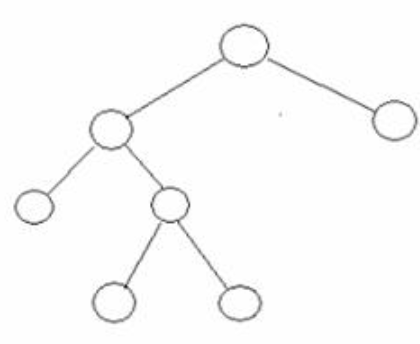
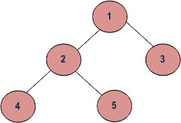

# Tree

In contrast to Arrays or Linked lists, that are linear structures where the time required to search is proportional to the size of the data. Trees represent a better alternative to store and search data. 

A Tree is defined as a collection of *nodes* connected by *directed or undirected edges*. By concept is non linear and has some particularities:

- It has one node that acts as a **root**.
- Every node (excluding the root) is conneted by a directed **edge** from one other node. In the form (parent -> children).
- Each node can have an arbitrary number of children. 
- Nodes with no children are called **leaves** or external nodes.
- Nodes that are not leaves are called **internal nodes** and have at least one child
- Nodes with same parent are called **siblings**.
- The **depth** of a node is the *number of edges* from the root to the node.
- The **height of a node** is the *number of edges* from the node to the deepest leaf.
- The **height of a tree** is the height of the root.

### Terminology


### Common uses 

- Arithmetic expressions to be parsed
- Priority queue ADT
- File system in a computer
- Syntax tree (used by compilers)
- Spanning trees, shortes path trees used in routers and bridges in computer networks

### Types


#### Binary Tree

A tree where each node has no more than two children (left child, right child). A binary tree with each node with exactly zero or two children is called a **full binary tree**. Also, a **complete binary tree** is a tree which is completely filled with the possible exception of the bottom level. A complete binary tree of the height h has between 2^h and 2^(h+1)-1 nodes.


binary tree representation:


full binary tree representation:



complete binary tree representation:


#### Binary search treee (BST)

Is a binary tree that when visited in the following order: left child, root, right child will produce a sequence that is ordered. A search inside a balanced binary search tree has a complexity of O(log n).

- All keys in the left subtree of x are less than the key in x.
- All keys in the right subtree of x are greater than the key in x.

Sample:


Sequence: {4, 10, 13, 16, 17, 19, 20, 22, 26, 29}

#### Heap

A tree data structure using arrays used to implement priority queues. [Won't be covered]

#### B-Tree / B+Tree

Used to implement indexing in databases [Won't be covered]

#### K-D Tree

A space partitioning tree used to organize points in K dimensional space. [Won't be covered]

#### Trie

Used to implement dictionaries with prefix lookup. [Won't be covered]

#### Suffix Tree

Quick pattern search in fixed texts. [Won't be covered]

#### AVL Tree [Balanced Tree]

A binary search tree such that for each node the heights of the left and right subtrees of the node differ by at most 1.


#### Red - Black Trees

A binary search tree where every "real" node has 0, 1 or 2 fake children to ensure that it always has two children.

Every node is colored either red or black so that:

- Every leaf node is black.
- If a node is red, then both its children are black.
- Every path from a node to a left contains the same number of black nodes.


### Big-O notation

In *Average* all operations in Trees are : O(log(n))

*Worst* Time Complexity:

| Type                     | Access    | Search    | Insertion | Deletion  |
| ------------------------ | --------- | --------- | --------- | --------- |
| Binary Search Tree (BST) | O(n)      | O(n)      | O(n)      | O(n)      |
| Cartesian Tree           | -         | O(n)      | O(n)      | O(n)      |
| B-Tree                   | O(log(n)) | O(log(n)) | O(log(n)) | O(log(n)) |
| Red Black Tree           | O(log(n)) | O(log(n)) | O(log(n)) | O(log(n)) |
| Splay Tree               | -         | O(log(n)) | O(log(n)) | O(log(n)) |
| AVL Tree                 | O(log(n)) | O(log(n)) | O(log(n)) | O(log(n)) |
| KD Tree                  | O(n)      | O(n)      | O(n)      | O(n)      |


## Operations

### Tree traversals 

Summary:


Considering the following:




#### Depth First 

#### Inorder

```
def inorder(tree) 
	inorder(tree -> left)
	visit root
	inorder(tree -> right)
end
```

(left, root, right) : { 4, 2, 5, 1, 3 }

In BST returns non-decreasing order.

#### Preorder

```
def preorder(tree) 
	visit root
	preorder(tree -> left)
	preorder(tree -> right)
end
```

(root, left, right) : { 1, 2, 4, 5, 3 }

Used to create copies of the tree. Also to get prefix expression on of an expression tree. [Why are prefix expressions useful?](http://en.wikipedia.org/wiki/Polish_notation)

#### Postorder

```
def postorder(tree) 
	preorder(tree -> left)
	preorder(tree -> right)
	visit root
end
```

(left, right, root) : { 4, 5, 2, 3, 1 }

Used to delete the tree. Also to get postfix expression of an expression tree. [More about postfix expression](http://en.wikipedia.org/wiki/Reverse_Polish_notation)


#### Breadth First  or Level Order

Method A - Use function to print a given level

```
def printLevel(tree, level)
	if tree is NULL then return
	if level is 1 then 
		print tree -> data
	else if level greater than 1, then
		printLevel(tree -> left, level-1)
		printLevel(tree -> right, level-1)		
end

def print(tree)
	for d = 1 to height(tree)
		printLevel(tree, d)
end
```

Method B - Using queue

```
def print(tree)
	create empty Queue q
	temp_node = root
	while temp_node NOT null
		print temp_node -> data
		q.enqueue(temp_node -> left)
		q.enqueue(temp_node -> right)		
		temp_node =	q.dequeue()
	end
end
```

{ 1, 2, 3, 4, 5 }


#### References

- [CMU - Data Structures](https://www.cs.cmu.edu/~clo/www/CMU/DataStructures/)
- [CMU - Tree Data Structure](https://www.cs.cmu.edu/~clo/www/CMU/DataStructures/Lessons/lesson4_1.htm)
- [TAMU - Tree Data Structure](http://faculty.cs.tamu.edu/welch/teaching/211.s03/lnotes3.pdf)
- [Big-O Notation](https://www.bigocheatsheet.com/)
- [Geeks for geeks - Tree traversals](https://www.geeksforgeeks.org/tree-traversals-inorder-preorder-and-postorder/?ref=rp)

